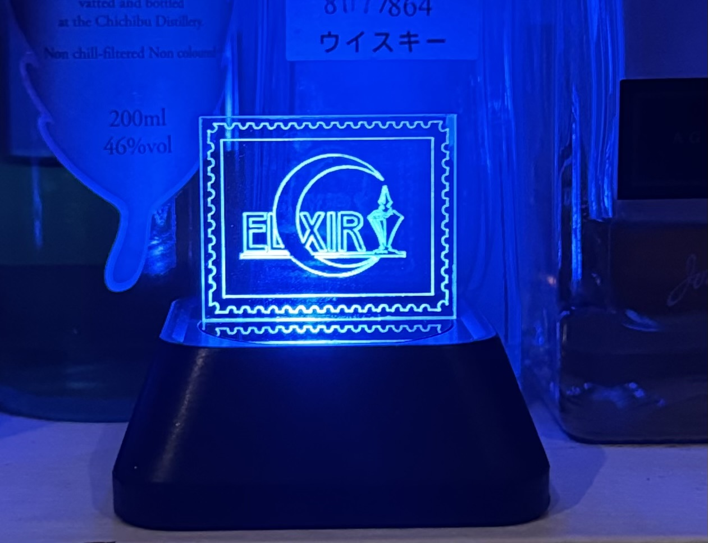

レーザーカッターによるアクリルカットで、[円形の台座](./Default_LED_stand36_5.svg)、および台座に取り付ける[プレート](./empty_stand_50R.svg)のデータを置いてあります。  
台座は2mm,3mmおよび5mm厚のプレート用の3種類が用意されています。  
ダイソーのリモコン付きLEDの上部を外し、円形の台座およびプレートを取り付けてください。  
プレートにはアクリル用蛍光ペンで文字を描くか、黒い極細線でレーザーカッター用の絵を描いてください。  
  
https://protopedia.net/prototype/6757  
